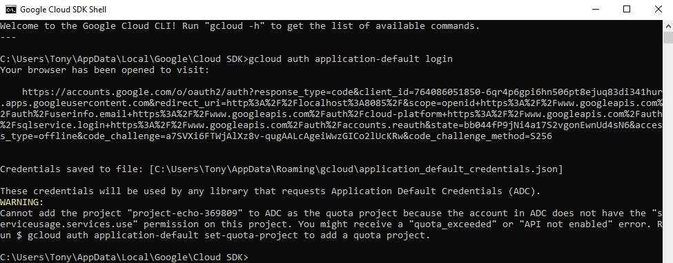

## Project Otways Dataset

There are currently 3 versions of this dataset up on Google Cloud Storage. They are as the following:

|  	bucket name | description  |
|---|---|
| project_echo_bucket_1    | This is a raw dump of all scraped data. Currently containing ALA and mammals datasets    |
| project_echo_bucket_2    | This is a bucket containing unedited training data for the 15 Otway species   |
| project_echo_bucket_3    | This is a bucket containing audio clips of up to 10s each with sliences filtered out   |
| project_echo_bucket_4    | This is a bucket containing audio clips of up to 5s each with sliences filtered out   |
| project_echo_birdclef    | Birdclef 2022 dataset for testing purposes  |

Google Cloud Project name: sit-23t1-project-echo-25288b9

## Instructions

This folder contains the code that give access to the Google Cloud Storage for the Project otways Dataset. Please follow the instructions below:

1. Install google cloud storage on your local dev environment
pip install google-cloud-storage

2. Install the Coogle Cloud CLI https://cloud.google.com/sdk/docs/install

3. Once installed, open the shell and type "gcloud auth application-default login". It will open up a browser.
Log in using your deakin credentials (xxxxxx@deakin.edu.au) and sign in using 2FA

You should see this if you're successfully authenticated

4. Open GoogleCloud_download.ipynb Bucket name is currently 'project_echo_bucket_1'. set dl_dir to the path where you want the dataset to be stored.

5. Run the python script. It should take around 20 minutes depending on the speed of your connection.

### Other scripts

audio_cleaning is responsible for removing the silences and voices at the start of each audio clip
GoogleCloud_upload can upload datasets to the online storage bucket
web_scraping_ala is used to scrape audio data from Atlas of Living Australia website
txt_cleaning is used to extraxt species found in the Otways from the book: __Grant Palmer. Wildlife of the Otways and Shipwreck Coast. Clayton, VIC: CSIRO PUBLISHING, 2019.__
audio_cleaning_2 is responsible for refining training data to detect sound onsets so no clip would be pure silence or background noise. 
